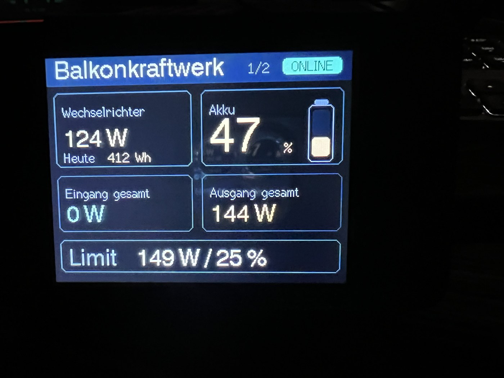
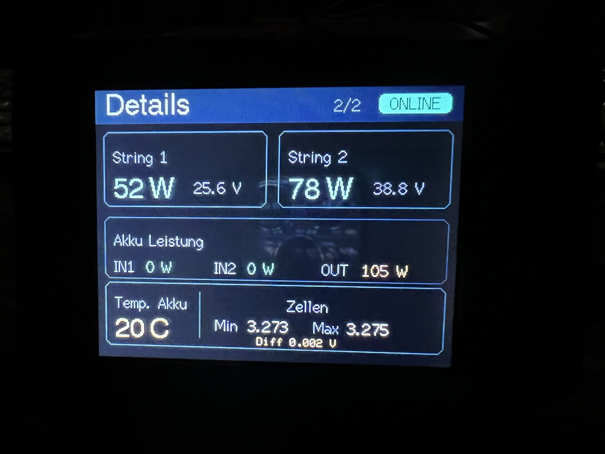
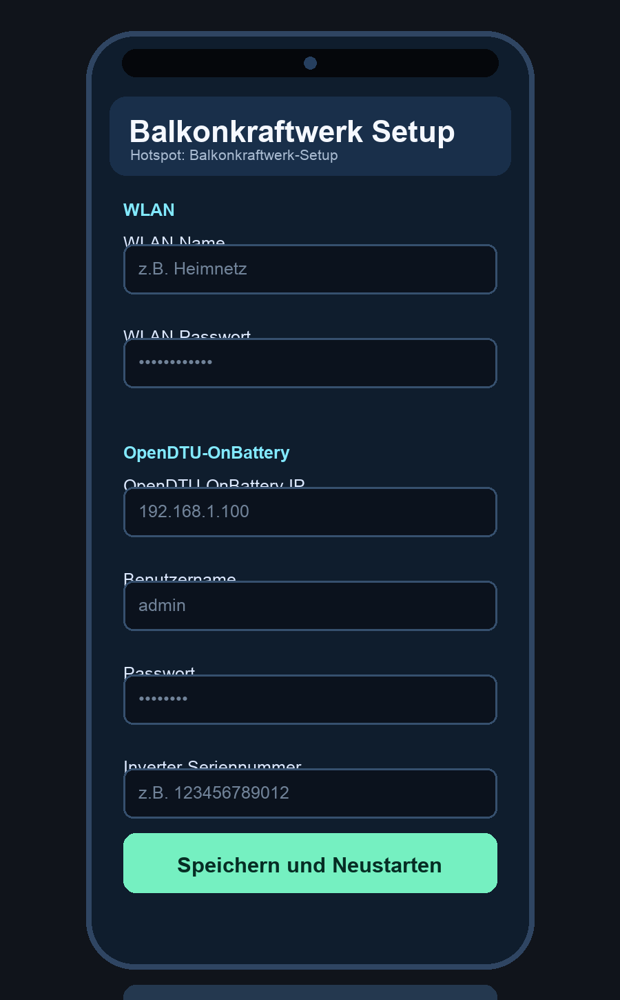

# Balkonkraftwerk Kombi-Display

Firmware fuer ein ESP32-2432S028R Display, das Daten einer OpenDTU-OnBattery-Installation und eines Marstek B2500 Akkus gemeinsam anzeigt.

Das Projekt ist ein privates Community-Projekt und kein offizielles OpenDTU-Projekt.

## Vorschau

### Display Seite 1



### Display Seite 2



### Hotspot-Einrichtung



## Funktionen

- 2 Display-Seiten fuer 320 x 240 Pixel im Querformat
- WLAN-Verbindung ueber Setup-Hotspot
- Eingabe der OpenDTU-OnBattery Zugangsdaten per Handy
- Anzeige von Wechselrichter-/PV-Werten ueber die lokale OpenDTU-OnBattery Web-API
- Automatische Suche des Marstek B2500 Akkus per Bluetooth LE
- Anzeige von Akkustand, Lade-/Entladeleistung, Temperatur und Zellspannungs-Differenz
- Keine fest eingebauten WLAN-Daten oder privaten Zugangsdaten

## Angezeigte Werte

### Seite 1

- aktuelle Wechselrichter-Leistung
- Tagesertrag
- Akkustand mit Ladebalken
- Eingang gesamt
- Ausgang gesamt
- aktuelles Leistungslimit in Watt und Prozent

### Seite 2

- String 1 Leistung und Spannung
- String 2 Leistung und Spannung
- Akku-Leistung IN1, IN2 und OUT
- Akku-Temperatur
- Zellspannung Min/Max
- Zellspannungs-Differenz

## Hardware

Getestet mit:

- ESP32-2432S028R, auch bekannt als 2,8 Zoll ESP32 Display oder Cheap Yellow Display
- OpenDTU-OnBattery im lokalen Netzwerk
- Marstek B2500 Akku per Bluetooth LE

## Flashen

Die fertige Factory-Firmware liegt hier:

```text
firmware/balkonkraftwerk-kombi-display-hotspot-v1-factory.bin
```

Empfohlene Flash-Methode:

1. Chrome oder Edge oeffnen.
2. ESPHome Web aufrufen:

   ```text
   https://web.esphome.io/?dashboard_install
   ```

3. Display per USB anschliessen.
4. Auf `CONNECT` klicken.
5. Seriellen Port auswaehlen.
6. Factory-BIN aus dem Ordner `firmware/` auswaehlen.
7. Installation starten.

Eine kurze PDF-Anleitung liegt hier:

```text
docs/Anleitung_Balkonkraftwerk_Display_Hotspot.pdf
```

## Einrichtung Nach Dem Flashen

Beim ersten Start sind keine Zugangsdaten gespeichert. Das Display startet deshalb einen Hotspot:

```text
Balkonkraftwerk-Setup
```

Mit dem Handy verbinden und im Browser oeffnen:

```text
http://192.168.4.1
```

Dort eintragen:

- WLAN-Name
- WLAN-Passwort
- OpenDTU-OnBattery IP
- OpenDTU Benutzername
- OpenDTU Passwort
- Inverter-Seriennummer

Nach dem Speichern startet das Display neu und verbindet sich mit dem eingetragenen WLAN.

## Verhalten Bei Fehlern

- Keine gespeicherten Daten: Setup-Hotspot startet automatisch.
- WLAN nicht erreichbar: Nach etwa 30 Sekunden startet der Setup-Hotspot erneut.
- OpenDTU-OnBattery nicht erreichbar: Das Display bleibt im normalen Betrieb und zeigt fehlende/offline Werte.
- Akku nicht gefunden: Der Marstek B2500 wird weiter per Bluetooth gesucht.

## Quellcode Bauen

Voraussetzung:

- Visual Studio Code
- PlatformIO Erweiterung

Dann:

1. Repository in VS Code oeffnen.
2. PlatformIO erkennt `platformio.ini`.
3. Build starten.

Die wichtigsten Dateien:

```text
src/main.cpp
src/config.h
src/config.example.h
platformio.ini
```

In der Hotspot-Version enthaelt `config.h` keine privaten Daten mehr. Zugangsdaten werden im ESP32-Speicher abgelegt.

## Hinweise

- Dieses Projekt nutzt die lokale OpenDTU-OnBattery Web-API.
- Es ist nicht vom OpenDTU-Projekt bereitgestellt oder betreut.
- Marstek B2500 wird per BLE-Geraetename `HM_B2500...` gesucht.
- Andere Marstek-Modelle oder andere BLE-Namen sind nicht garantiert kompatibel.

## Lizenz

MIT License, siehe `LICENSE`.
